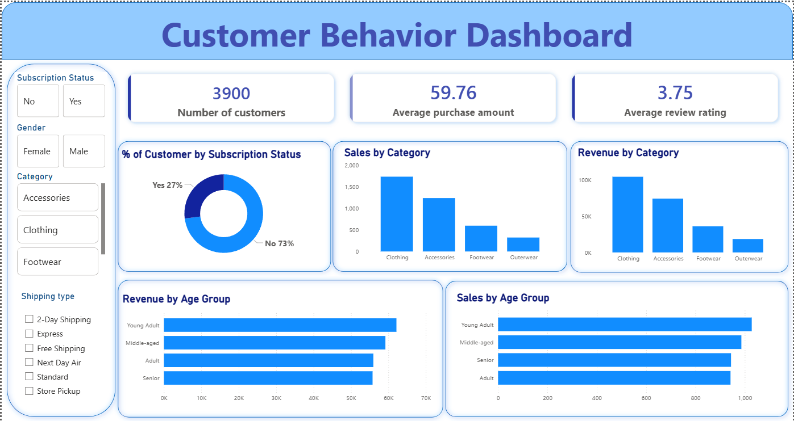

# Customer Shopping Behavior Analysis & Dashboard

An end-to-end data analytics project using Python (Pandas) for data cleaning and Power BI for interactive visualization of customer purchasing behavior.

---

## 📊 Dashboard Preview

---

## 📌 Project Overview

The goal of this project is to analyze customer shopping patterns, subscription status, and product performance to help businesses optimize inventory and marketing strategies.

---

## 🧹 Data Cleaning Process (Python)

Data preprocessing was performed using Python (`customer_shopping_behavior_analysis.ipynb`):
* Handled missing values and standardized data types.
* Cleaned column names and formatted key columns for downstream visualization.
* Exported the clean dataset for Power BI modeling.

---

## 📈 Key Insights

* Total Customers: 3,900
* Average Purchase Amount: $59.76
* Average Review Rating: 3.75 / 5.00
* Subscription Split: 27% Subscribed vs 73% Non-Subscribed customers.
* Top Category: Clothing dominates in overall sales volume and revenue, followed by Accessories.
* Demographics: Young Adults account for the highest revenue contribution.

---

# 🛠️ Tools & Technologies Used

* Python (Pandas, NumPy): Data Preprocessing & Cleaning
* Power BI Desktop: DAX Measures, Data Modeling, Dynamic Visuals, and Layout
* CSV: Source & Clean Data Storage

